<h1 align="center">Olá, eu sou o Rafael 👋</h1>

<h3 align="center">Desenvolvedor Full-Stack | Automações com Python | IA & APIs (Claude, OpenAI e afins)</h3>

  Construindo aplicações web · Automatizando processos com Python · Integrando IA em soluções reais 🚀

---

### 🚀 Sobre mim

- 💻 Trabalho com **desenvolvimento web** (front-end e back-end)
- 🐍 Crio **automações em Python** para otimizar processos
- 🤖 Integro **IA (Claude, APIs de LLM)** em aplicações reais
- 🌱 Sempre explorando novas ferramentas e boas práticas
- 📫 Contato: LinkedIn, e-mail e Instagram nos links abaixo

---

### 🛠️ Tecnologias e Ferramentas

  
  
  
  
  
  
  
  
  
  
  
  

---

### 📊 Estatísticas do GitHub

  

> As estatísticas acima são geradas automaticamente por uma GitHub Action e atualizadas todo dia — não dependem de serviços externos, então não ficam fora do ar.

---

### 📌 Projetos em destaque

  

> Substitua/adicione outros repositórios aqui, repetindo o bloco acima com o nome do repo desejado.

---

### 📫 Contato

  
  
  

  

